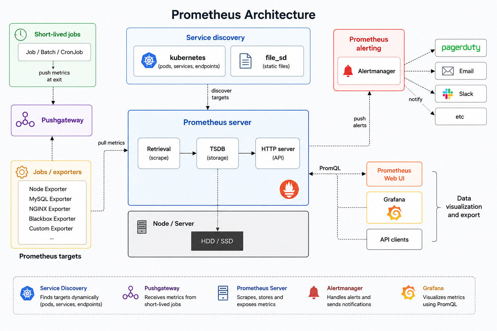

# Module 2 – Prometheus Architecture

In this module, we'll understand how Prometheus collects, stores, queries, visualizes, and alerts on monitoring data.

## Topics Covered

- Prometheus Architecture
- Prometheus Server
- Exporters
- Node Exporter
- kube-state-metrics
- Targets
- Service Discovery
- Pull Model
- Pushgateway
- Alertmanager
- Grafana Integration

> **Note:** Understanding the architecture helps in installation, troubleshooting, and interview preparation.

---

# 1. Prometheus Architecture

Prometheus follows a **pull-based monitoring architecture**.

Applications, operating systems, and Kubernetes components expose metrics through exporters. Prometheus periodically scrapes these metrics, stores them in its Time Series Database (TSDB), allows querying using PromQL, visualizes data through Grafana, and sends alerts using Alertmanager.

---

## High-Level Architecture

```text
                    Kubernetes Cluster
┌─────────────────────────────────────────────────────────┐
│                                                         │
│   Node 1               Node 2              Node 3       │
│                                                         │
│  ┌────────┐         ┌────────┐         ┌────────┐        │
│  │  Pods  │         │  Pods  │         │  Pods  │        │
│  └────────┘         └────────┘         └────────┘        │
│                                                         │
│        ▲                  ▲                  ▲          │
│        │                  │                  │          │
│     Metrics            Metrics           Metrics        │
└────────┼──────────────────┼──────────────────┼──────────┘
         │                  │                  │
         ▼                  ▼                  ▼
    Exporters         Node Exporter    kube-state-metrics
              \            |            /
               \           |           /
                └──────────┼──────────┘
                           │
                    Prometheus Server
                           │
         ┌─────────────────┴─────────────────┐
         │                                   │
         ▼                                   ▼
   Time Series Database               Alertmanager
         │
         ▼
      PromQL
         │
         ▼
      Grafana
```

---

## Monitoring Flow

1. Applications and Kubernetes components generate metrics.
2. Exporters expose the metrics.
3. Prometheus scrapes metrics at regular intervals.
4. Metrics are stored in the Time Series Database (TSDB).
5. PromQL queries retrieve the required metrics.
6. Grafana visualizes the metrics.
7. Alertmanager sends notifications whenever alert rules are triggered.

---

# 2. Official Prometheus Architecture

The following diagram shows the complete Prometheus architecture used in production environments.



This architecture introduces additional components such as:

- Service Discovery
- Retrieval
- HTTP Server
- Pushgateway
- Alertmanager
- Prometheus Web UI
- API Clients

We'll understand each of these components below.

---

# 3. Prometheus Server

Prometheus Server is the core component of the monitoring system.

It is responsible for:

- Discovering targets
- Scraping metrics
- Storing metrics
- Executing PromQL queries
- Evaluating alert rules
- Sending alerts to Alertmanager

Think of Prometheus Server as the **brain of the monitoring system**.

---

## Internal Components of Prometheus Server

### Retrieval

Responsible for scraping metrics from configured targets.

Example:

```text
Every 15 seconds

↓

Collect Metrics

↓

Store Metrics
```

---

### TSDB (Time Series Database)

Stores all collected metrics.

Example:

| Time | CPU |
|------|----:|
|10:00|20%|
|10:01|24%|
|10:02|31%|

---

### HTTP Server

Provides:

- Prometheus Web UI
- HTTP API
- PromQL endpoint

Default Port:

```text
9090
```

---

# 4. Exporters

Prometheus cannot directly understand operating systems, databases, or applications.

Exporters collect metrics from these systems and expose them in Prometheus format.

Think of an Exporter as a **translator**.

Common exporters include:

- Node Exporter
- kube-state-metrics
- MySQL Exporter
- NGINX Exporter
- Blackbox Exporter
- Redis Exporter

---

# 5. Node Exporter

Node Exporter collects Operating System metrics.

Examples:

- CPU Usage
- Memory Usage
- Disk Usage
- Network Usage
- File System Usage
- System Load
- Uptime

Think of Node Exporter as the monitoring agent for Linux servers.

---

# 6. kube-state-metrics

Node Exporter monitors Linux.

kube-state-metrics monitors Kubernetes objects.

Examples:

- Pods
- Deployments
- ReplicaSets
- StatefulSets
- DaemonSets
- Jobs
- Services
- Namespaces

---

## Difference Between Node Exporter and kube-state-metrics

| Node Exporter | kube-state-metrics |
|---------------|--------------------|
| Linux Metrics | Kubernetes Metrics |
| CPU Usage | Pod Status |
| Memory Usage | Deployment Status |
| Disk Usage | ReplicaSets |
| Network Usage | StatefulSets |
| Uptime | Namespaces |

---

# 7. Targets

A Target is any endpoint that Prometheus scrapes.

Examples:

- Node Exporter
- kube-state-metrics
- Applications
- MySQL
- Redis
- NGINX

Every monitored endpoint is called a Target.

---

# 8. Service Discovery

Applications and Pods are dynamic.

Their IP addresses may change whenever they restart.

Instead of manually updating Prometheus, it automatically discovers new targets.

Common Service Discovery mechanisms:

- Kubernetes Service Discovery
- File-based Discovery (`file_sd`)
- Static Configurations

---

# 9. Pull Model

Prometheus uses the **Pull Model**.

```text
Prometheus
      │
      ▼
Requests Metrics
      │
      ▼
Exporter
      │
      ▼
Returns Metrics
```

Advantages:

- Centralized scraping
- Easy health checking
- Automatic discovery
- Better scalability

---

# 10. Pushgateway

Some applications are short-lived.

Examples:

- CronJobs
- Batch Jobs
- Backup Jobs

These jobs may finish before Prometheus scrapes them.

Instead, they push metrics to Pushgateway.

```text
Short-lived Job
       │
       ▼
Pushgateway
       │
       ▼
Prometheus
```

> Pushgateway is used only for short-lived jobs. Regular applications should expose metrics for Prometheus to scrape.

---

# 11. Alertmanager

Prometheus continuously evaluates alert rules.

Example:

```text
CPU Usage > 90%
```

When an alert condition is met, Prometheus sends it to Alertmanager.

Alertmanager can notify through:

- Email
- Slack
- Microsoft Teams
- PagerDuty
- Webhooks

---

# 12. Grafana Integration

Grafana does not collect metrics.

It connects to Prometheus as a data source.

Workflow:

```text
Grafana
      │
      ▼
PromQL Query
      │
      ▼
Prometheus
      │
      ▼
Time Series Data
      │
      ▼
Dashboard
```

Grafana provides:

- Dashboards
- Line Charts
- Bar Charts
- Gauges
- Tables
- Heatmaps

Think of Grafana as the **Visualization Layer**.

---

# Summary

After completing this module, you should understand:

- ✅ Prometheus Architecture
- ✅ Prometheus Server
- ✅ Retrieval
- ✅ TSDB
- ✅ HTTP Server
- ✅ Exporters
- ✅ Node Exporter
- ✅ kube-state-metrics
- ✅ Targets
- ✅ Service Discovery
- ✅ Pull Model
- ✅ Pushgateway
- ✅ Alertmanager
- ✅ Grafana Integration

---

# Next Module

## Module 3 – Installing Prometheus & Grafana

Topics:

- Add Helm Repository
- Install kube-prometheus-stack
- Verify Installation
- Access Prometheus
- Access Grafana
- Explore Dashboards