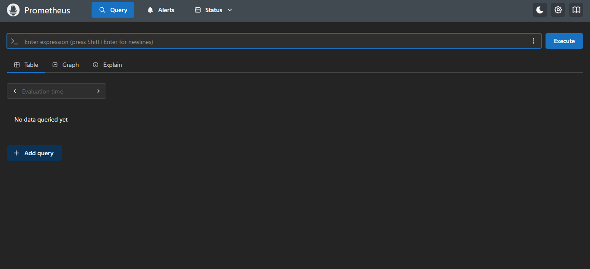
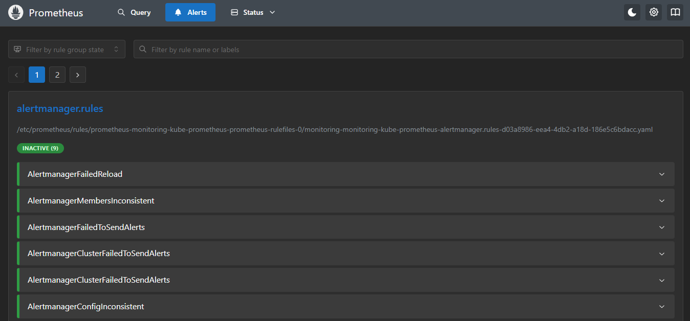
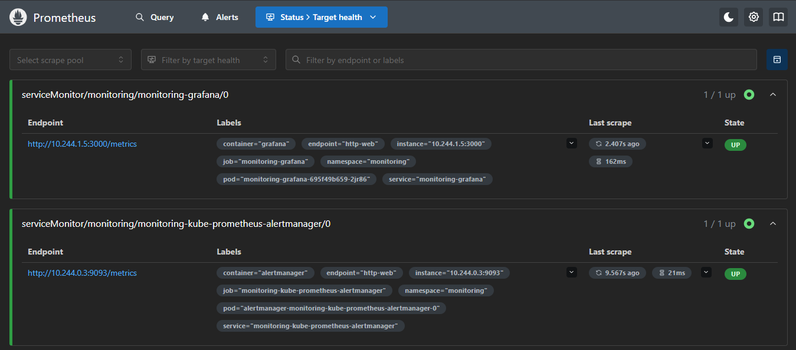
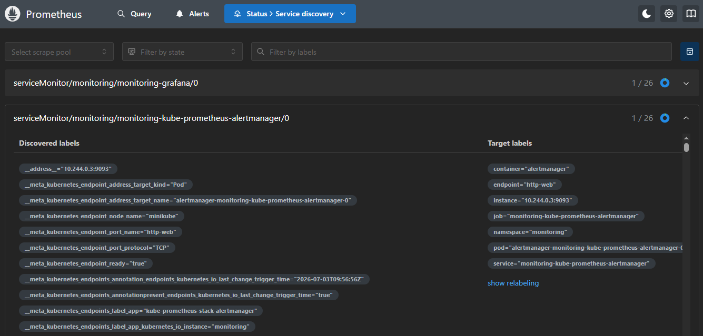

# Module 4 – Prometheus UI Overview

In this module, we explore the Prometheus Web UI and understand the purpose of its major sections.

The Prometheus UI is primarily used to:

- Run PromQL queries
- Verify target health
- Monitor alerts
- Troubleshoot service discovery

---

# Sections Covered

The main sections explored are:

- Query
- Alerts
- Status
  - Target Health
  - Service Discovery

---

# 1. Query

The **Query** page is the most frequently used section of Prometheus.

It allows you to:

- Execute PromQL queries
- View metrics
- Display query results as tables
- Display query results as graphs

Example queries:

```promql
up
```

```promql
node_cpu_seconds_total
```

This page is used daily by DevOps Engineers to explore metrics and execute PromQL queries. PromQL will be covered in the next module.

## Screenshot



---

# 2. Alerts

The **Alerts** page displays all alert rules configured in Prometheus.

Each alert can be in one of three states:

- Inactive
- Pending
- Firing

This page helps identify current issues in the monitored environment.

For example:

- A node becomes unavailable
- A pod continuously restarts
- CPU usage exceeds the configured threshold
- Disk space is running low

## Screenshot



---

# 3. Status → Target Health

The **Target Health** page shows every target currently being monitored by Prometheus.

For each target, it displays:

- Job
- Endpoint
- Labels
- Last Scrape Time
- Scrape Duration
- Target State (UP or DOWN)

This page is commonly used to:

- Verify that Prometheus is successfully scraping metrics
- Troubleshoot failed targets
- Identify unreachable endpoints
- Check the health of exporters and Kubernetes components

An **UP** status indicates that Prometheus is successfully collecting metrics.

A **DOWN** status indicates that Prometheus cannot scrape metrics from that target.

## Screenshot



---

# 4. Status → Service Discovery

The **Service Discovery** page shows how Prometheus automatically discovers monitoring targets from Kubernetes.

It displays two types of labels:

- Discovered Labels
- Target Labels

### Discovered Labels

Discovered Labels are raw metadata collected from the Kubernetes API.

They usually begin with:

```text
__meta_kubernetes_*
```

Examples:

- `__meta_kubernetes_namespace`
- `__meta_kubernetes_pod_name`
- `__meta_kubernetes_service_name`

These labels are mainly used internally during service discovery and relabeling.

---

### Target Labels

Target Labels are the labels that Prometheus finally keeps after relabeling.

The most commonly used Target Labels are:

- job
- instance
- namespace
- pod
- service
- container
- endpoint

These labels are heavily used in:

- PromQL Queries
- Grafana Dashboards
- Alert Rules

These labels are the most commonly used when writing PromQL queries, creating Grafana dashboards, and defining alert rules.

## Screenshot



---

# When Do We Use Each Page?

| Page | Purpose |
|------|---------|
| Query | Execute PromQL queries and explore metrics |
| Alerts | Monitor alert states (Inactive, Pending, Firing) |
| Target Health | Verify whether Prometheus is successfully scraping targets |
| Service Discovery | Understand how Prometheus discovers Kubernetes targets and labels |

---

# Key Takeaways

- The **Query** page is used daily for running PromQL queries.
- The **Alerts** page helps monitor active alerts in the cluster.
- The **Target Health** page is the first place to check when metrics are missing.
- The **Service Discovery** page helps troubleshoot automatic target discovery and relabeling.
- **Target Labels** are used extensively in PromQL, Grafana dashboards, and alert rules.
- **Discovered Labels** are primarily used internally during Kubernetes service discovery.

---

# Summary

After completing this module, you should understand:

- ✅ Purpose of the Prometheus Web UI
- ✅ Query Page
- ✅ Alerts Page
- ✅ Target Health Page
- ✅ Service Discovery Page
- ✅ Difference between Discovered Labels and Target Labels
- ✅ When each page is used in real-world troubleshooting

---

# Next Module

**Module 5 – PromQL (Prometheus Query Language)**

Topics:

- What is PromQL?
- Instant Queries
- Range Queries
- Selectors
- Labels
- Operators
- Functions
- Aggregations
- Real-world PromQL Examples